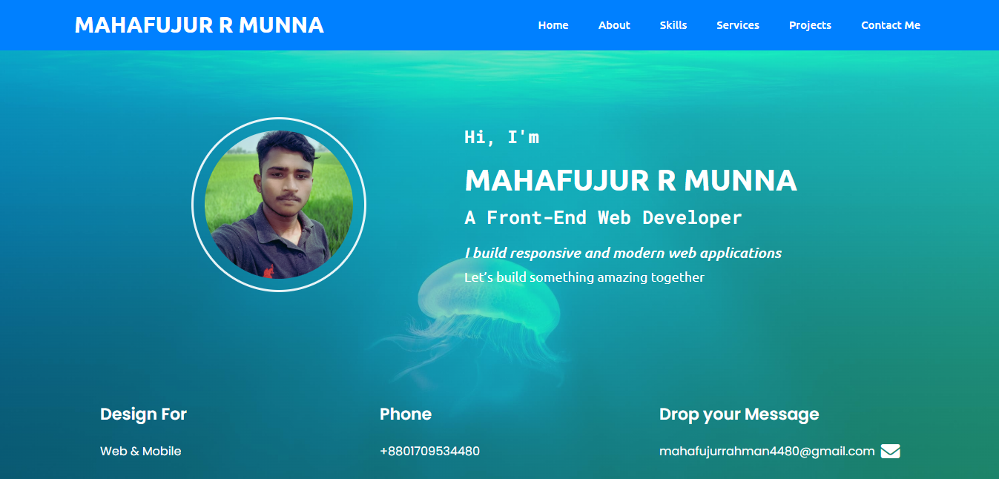

# MAHAFUJUR-R-MUNNA
# 🌐 Personal Portfolio Website  

Welcome to my **personal portfolio website** repository!  
This website is built to showcase my personal details, skills, projects, and services in a professional way.  

---

## 🚀 Features  
- Fully responsive for **desktop & mobile**  
- Modern and clean design  
- Section for my **personal info & introduction**  
- **Projects showcase** with details  
- **Services section** to highlight what I offer  
- Contact details for direct communication  

---

## 🛠️ Skills & Technologies  
- **HTML5** – Semantic and structured content  
- **CSS3** – Styling, layout, and responsiveness  
- **JavaScript (JS)** – Interactivity and dynamic features  

---

## 📂 Projects  
This portfolio highlights my personal and professional projects.  
Each project reflects my **front-end development skills**, problem solving, and creativity.  

---

## 📞 Contact  
If you want to **connect, collaborate, or hire me**, you can find my contact details directly on the website.  

---

## 🔗 Live Demo  
👉 [View Website](https://mahafujur80.github.io/MAHAFUJUR-R-MUNNA/)  

---

## 🖼️ Preview  
  

---

✨ This portfolio represents **who I am, what I do, and how I can help you with professional web solutions.**  

